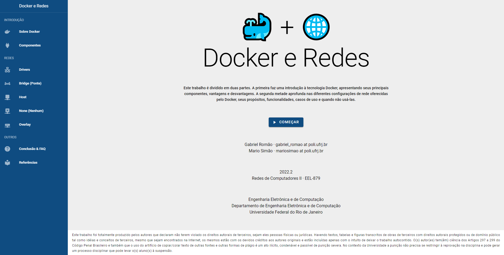

<h1 align="center">Docker e Redes</h1>
<p align="center">
  <a href="https://mario.engineering/docker-e-redes" target="_blank">
    
  </a>
</p>

Website built during the "Computer Networks II" course.

https://mario.engineering/docker-e-redes

## Project setup
```
npm install
```

### Compiles and hot-reloads for development
```
npm run dev
```

### Compiles and minifies for production
```
npm run build
```

### Lints and fixes files
```
npm run lint
```
